# SkyClock

> **Time, atmosphere and the sky — on your table**

A stylish desk clock that shows the time with an analog-digital dial, monitors temperature, humidity and atmospheric pressure, records 24-hour trends with intuitive charts, and indicates sunrise and sunset times as well as the position of the Moon and the main planets. All accompanied by a gentle cuckoo every hour and bells at noon.

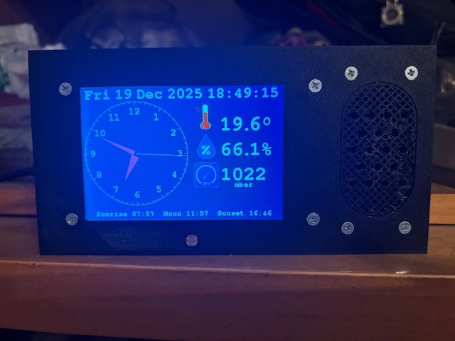

Bring to your table an object that tells the story of time and the sky. **SkyClock** combines a large, readable display with precision microclimate sensors and local astronomical calculations: sunrise/sunset times, the position of the Moon and the planets Mercury, Venus, Mars, Jupiter and Saturn. It records temperature, humidity and pressure trends over the last 24 hours and displays them with intuitive charts. A sweet cuckoo every hour; bells at noon. Set your preferred alarm and customize every aspect to your needs.

<p float="left" >
  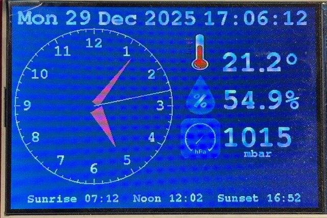
  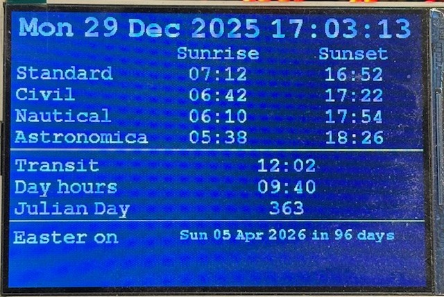
  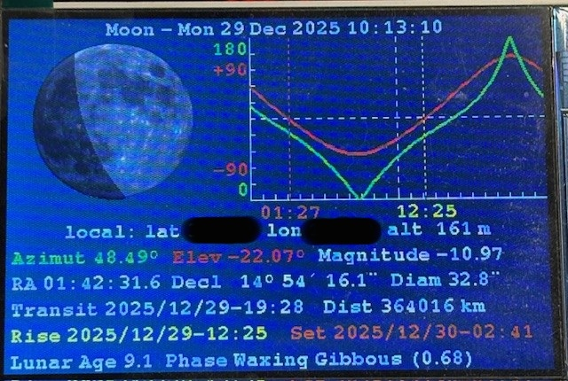
  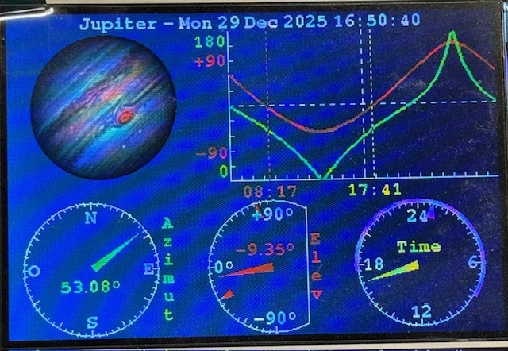
  
  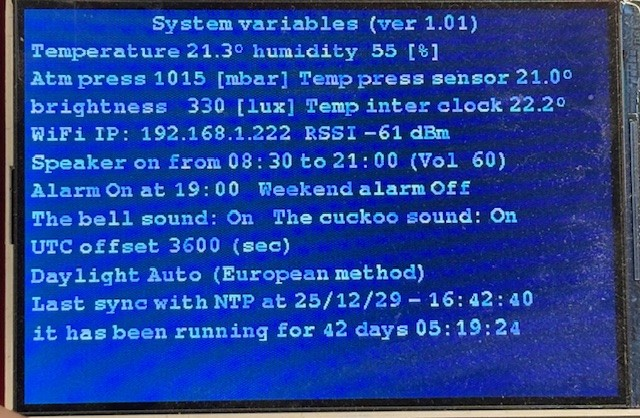
</p>

## Features

- **Main dial**: large analog-digital display with overlay readings of temperature, humidity and atmospheric pressure values.

- **Additional screens**: sunrise and sunset times and a simplified night sky map showing the position of the Moon and visible planets (Mercury, Venus, Mars, Jupiter, Saturn).

- **24h log**: automatic sampling and storage of environmental data with charts that can be viewed directly on the display.

- **Customizable chimes**: cuckoo every hour, bells at noon and configurable alarm. Sound activation options include the ability to disable the cuckoo during nighttime hours.

- **Setup via web server**: connect to **SkyClock** via WiFi and use your smartphone and a web browser to configure all parameters to your liking.

## Technical specifications

- **Display**: 4.0 Inch SPI TFT LCD Module 4.0" with ILI9488 driver, resolution 480×320 pixels and brightness control.
- **Sensors**: digital thermometer, hygrometer and precision barometer.
- **Memory**: rolling log of the last 24 hours, sampling every 30 seconds, storage every 10 minutes.
- **Astronomical calculation**: positions and times calculated locally from latitude and longitude. Calculation of sunrise/sunset, right ascension, declination, altitude, azimuth and magnitude. Moon phases with limb angle and parallax calculations.
- **Audio**: integrated speaker with cuckoo, bells and customizable alarm sounds; adjustable volume.
- **Power**: 5V adapter with backup battery to preserve the clock.
- **Connectivity**: WiFi, access point mode and automatic synchronization with NTP servers for maximum accuracy.

## Contents

- [Setup Guide](#setup-guide)
  - [List of Components](#list-of-components)
  - [Wiring](#wiring)
  - [Printed Circuit Board](#printed-circuit-board)
  - [3D Printer Box Creation](#3d-printer-box-creation)
- [Assembly](#assembly)
  - [Compilation](#compilation)
    - [FileSystem](#filesystem)
  - [How to assemble it](#how-to-assemble-it)
  - [Configuration](#configuration)
- [Warnings](#warnings)
- [Licensing](#licensing)
- [Disclaimer](#Disclaimer)

## Setup Guide

### List of Components

Here is the complete list of electronic components needed to build the project. The provided links are for indication only and to help you find the parts.

> ***WARNING***: the display must necessarily have the ILI9488 driver

| Component Type   | Component                                                              | Link                                                                                                              |
| ---------------- | ---------------------------------------------------------------------- | ----------------------------------------------------------------------------------------------------------------- |
| LCD TFT 4.0 inch | 4.0 inch SPI TFT LCD no touch screen 480×320 pixel color display _(1)_ | Available [here](https://it.aliexpress.com/item/1005006102051152.html)                                            |
| SHT30            | Temperature humidity sensor                                            | Available [here](https://it.aliexpress.com/item/1005006939280040.html)                                            |
| MAX98357         | 3W Class D Amplifier Breakout Interface I2S Decoder DAC for Audio      | Available [here](https://it.aliexpress.com/item/1005006711010527.html)                                            |
| ESP32            | ESP32 38Pin CP2102 micro USB                                           | Available [here](https://it.aliexpress.com/item/1005006351235505.html)                                            |
| Speaker          | PCS 3 Watt 8 Ohm Micro Speaker                                         | Available [here](https://www.amazon.it/HUAREW-Altoparlante-interfaccia-JST-PH2-0-elettronici/dp/B0CRNZYW1R/)      |
| DS3231           | AZDelivery Real Time Clock RTC DS3231 and Free Battery Included        | Available [here](https://www.amazon.it/AZDelivery-Arduino-Raspberry-Microcontroller-AT24C32/dp/B076GP5B94/)       |
| BMP180           | AZDelivery 3 x GY-68 BMP180 Barometric Pressure Sensor                 | Available [here](https://www.amazon.it/AZDelivery-Pressione-Barometrica-Raspberry-gratuito/dp/B07FRW7YTK/)        |
| Button           | 16mm Plastic Momentary Push Button Switch, Round Head Button           | Available [here](https://www.amazon.it/QitinDasen-Interruttore-Pulsante-Momentaneo-Plastica/dp/B08GPFTJ4Q/)       |
| PCB Connectors   | 2.54mm Pitch 40 Pin Breakaway PCB Board                                | Available [here](https://www.amazon.it/Breakaway-Connettore-Intestazione-Connettori-Prototype/dp/B0DJ2MYFMB/)     |
| GL5516           | Photoresistor 5 mm - 10 Lux: 5-10 kOhm, Dark Resistance: 0.5 MOhm      | Available [here](https://www.amazon.it/qualit%C3%A0-GL5516-Light-Dependent-Resistor-Photoresistor/dp/B00NXW9WZ6/) |
| 4 resistors      | 1/4 watt: n.2 → 4,7 kOhm, n.1 → 47 kOhm, n.1 → 10 kOhm                 |                                                                                                                   |
| Capacitor        | 1000µF 16 Volt capacitor                                               |                                                                                                                   |

_(1) Note: it is listed as driver ST7796S but actually mounts the ILI9488 chip_

### Wiring

Here is the complete electrical schematic for the project. Building it is relatively simple, but if you decide to wire it manually without using the PCB, pay close attention to component polarities to avoid damage.

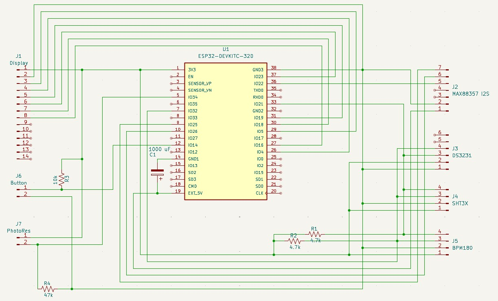

### Printed Circuit Board

The files needed to make the printed circuit board are available in this [folder](pcb/).

The printed circuit board is designed as a double-sided board. Pads were added for electrical connection between the Front and Back sides, making it possible to make the PCB even at home using a CNC milling machine. I personally use [FlatCAM](http://flatcam.org/) to generate .nc files to send to the CNC machine.

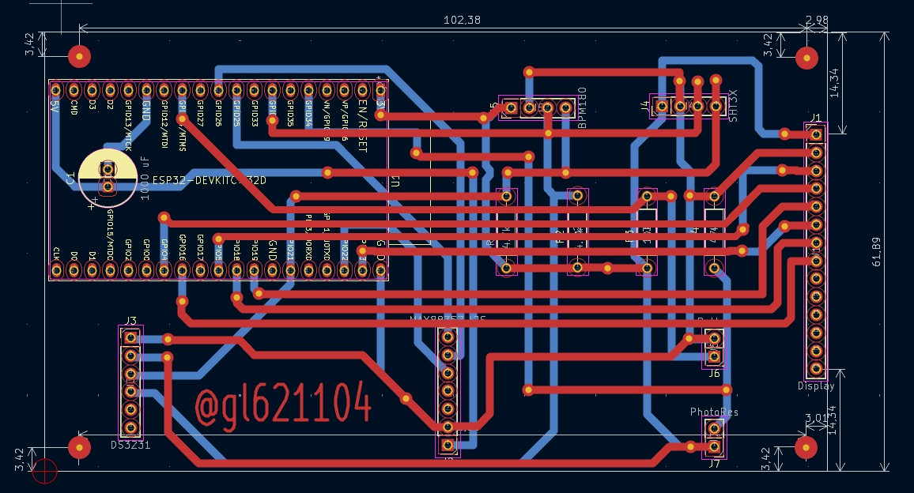

**Important note**: the PCB is prepared for soldering the display on the Front side. In this way the holes for supporting the PCB match exactly the holes of the display and those foreseen in the enclosure made with the 3D printer.

### 3D Printer Box Creation

To complete the project I designed an enclosure with [FreeCAD](https://www.freecad.org/) sized 165×85×45 mm to be made with a 3D printer. The enclosure was designed to perfectly host the PCB with the display connected, as you can see in the section [How to assemble it](#how-to-assemble-it).

<p float="left" >
  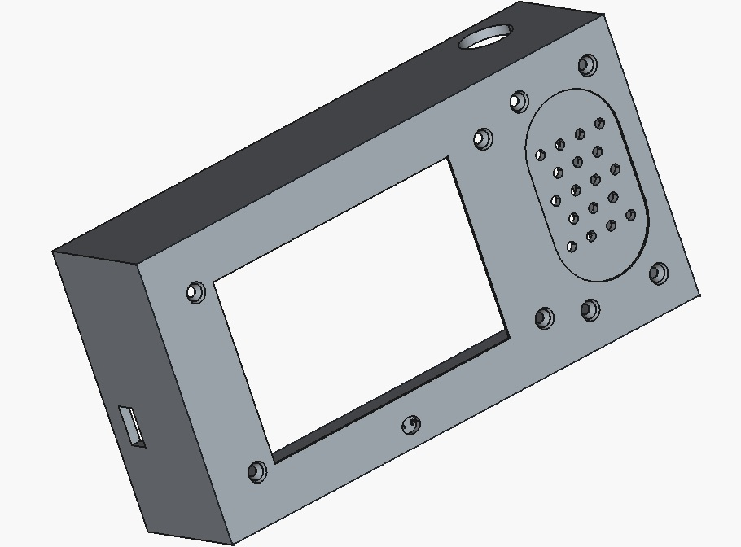
  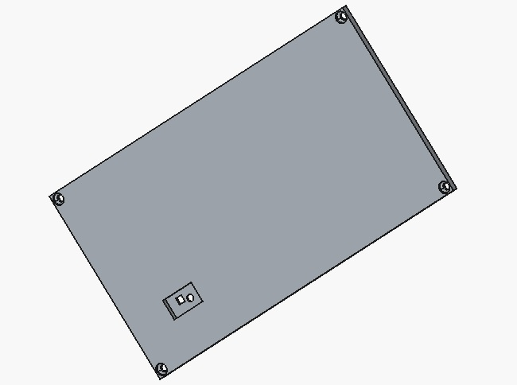
</p>

The .stl files are available in this [folder](print3d/). There are no particular criticalities in printer setup. I used the following settings with [Cura](https://ultimaker.com/software/ultimaker-cura/):

- Generic PLA
- 0.4 mm Nozzle
- Infill Density 30%
- Infill Pattern Cubic
- Support On
- Adhesion Off

The only important precaution is to enable supports (Support On) to avoid problems when creating the holes.

## Assembly

### Compilation

To compile the **SkyClock** software you need to have the [Arduino 2.x](https://docs.arduino.cc/software/ide-v2/tutorials/getting-started/ide-v2-downloading-and-installing/) IDE installed. First install support for ESP32. I recommend this tutorial: [Installing ESP32 Board in Arduino IDE 2](https://randomnerdtutorials.com/installing-esp32-arduino-ide-2-0/)

Next you need to install the driver for uploading the FileSystem. Again I recommend this tutorial: [Arduino IDE 2: Install ESP32 LittleFS Uploader](https://randomnerdtutorials.com/arduino-ide-2-install-esp32-littlefs/)

The code requires the [ESP8266Audio](https://github.com/earlephilhower/ESP8266Audio) library created by [earlephilhower (Earle F. Philhower, III)](https://github.com/earlephilhower). To install it go to 'LIBRARY MANAGER', search for ESP8266Audio and proceed with the installation.


Now we can proceed with compilation. Load the SkyClock32.ino file from the [SkyClock32](SkyClock32/) folder, select the board "ESP32 Dev Module" and Partition Scheme: "No OTA (2MB APP/2MB SPIFFS)".


At this point we can upload the data to the ESP32 filesystem (on Windows press [Ctrl] + [Shift] + [P]). All files present in the [data](SkyClock32/data) folder will be copied to the ESP32. After this step, compile and upload the program. Your **SkyClock** is ready to use!

#### FileSystem

In the [data](SkyClock32/data) folder are the files that will be copied into the ESP32 FileSystem. These are mainly .mp3 files for the noon bell sounds. There are 31 files that will be chosen randomly, one different for each day of the month, and then repeat the next month again randomly.

Of course you can change or add the sounds you prefer. The file name is not important (maximum 16 characters) but the extension must necessarily be .mp3. To avoid overloading the ESP32 memory it is recommended that files be mono with sampling at 8 kbps.

There is also the subfolder [as](SkyClock32/data/as) which contains 3 mp3 files. In this case the file naming is significant. You can modify their names inside the SkyClock32.ino code through the following constants:

```c
#define NAME_FILE_CUCU_PLAY "/as/CUCUCLK.mp3"
#define NAME_FILE_ALARM_CLOCK "/as/alarmClock1.mp3"
#define NAME_FILE_INIT_SOUND "/as/InitSound.mp3"
```

In particular these mp3 files are used for:

- `NAME_FILE_CUCU_PLAY` → plays the cuckoo every hour
- `NAME_FILE_ALARM_CLOCK` → is the alarm sound
- `NAME_FILE_INIT_SOUND` → is played only when **SkyClock** is turned on and is used to verify that the audio system is functioning correctly

### How to assemble it

Once the PCB and the enclosure have been made and all components soldered, we can proceed with final assembly. Get 3 mm screws with matching nuts. Length is not critical, just make sure it is longer than 10 mm (I used 15 mm screws). Also required are 4 screws of 30 mm which will be used to secure the display and the PCB.

The first component to mount is the speaker. The operation is not particularly difficult, but pay attention to the screws near the edges of the enclosure.


Next mount the photoresistor. First cut the component leads to the right height (about halfway) so they can be inserted into the appropriate holes. If you prefer, you can simply solder them directly. A bit of adhesive tape will give stability to the connection.

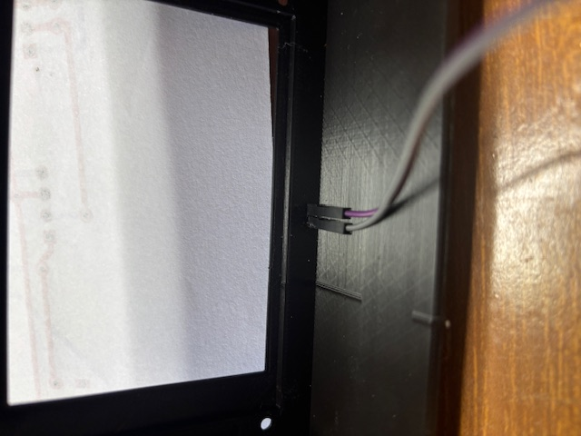

Proceed with mounting the button, having previously soldered the electrical contacts. Pay attention during screwing, the nut is close to the speaker. Do not overtighten.

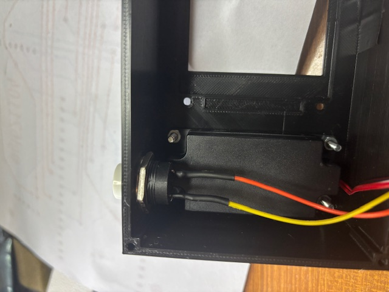

Now move on to the most delicate part of the assembly. Use the 30 mm screws and insert the display so that the connectors face the speaker. Screw everything without over-tightening, leaving a small amount of play.


Insert 4 nuts on the 30 mm screws, positioning them so they are perfectly flat and at the correct height to allow the display connectors to latch onto the PCB.

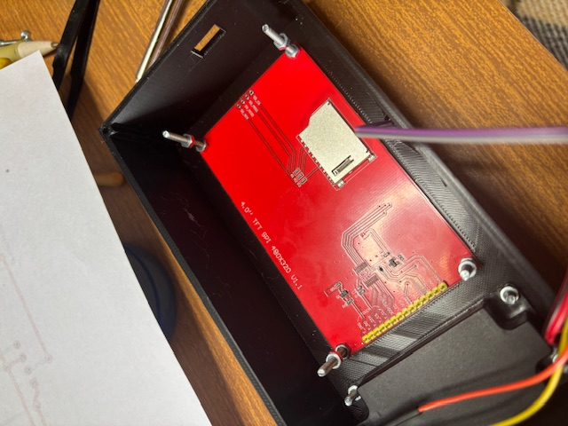

At this point insert the PCB and attach the display. Check that the ESP32 mini-USB connector is perfectly aligned with the side hole of the enclosure so that the USB cable can be easily inserted. Secure everything with 4 more nuts.


Proceed to mount the SHT30 sensor in the enclosure lid. The grooves on the surface guide the insertion of the SHT30 into a single correct position. Fasten everything with a 10 mm screw.

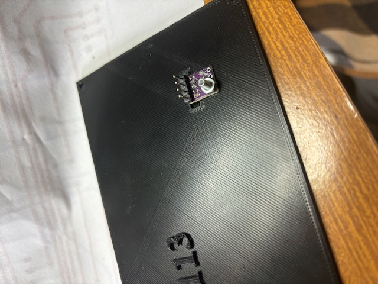

If you want more accurate readings, you can insert a strip of expanded polystyrene to isolate the SHT30 sensor from the internal heat of the enclosure, making measurements more accurate.

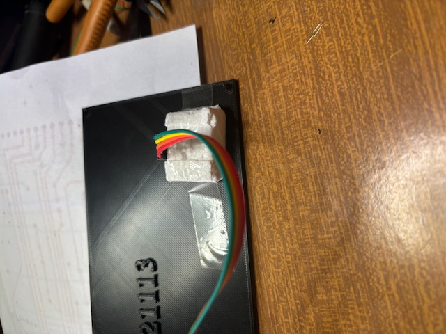

Complete the assembly by making the final connections, paying **close attention to component polarities** to avoid damage.


### Configuration

There are two modes to configure **SkyClock**. The first allows you to change some parameters during normal operation using the built-in button. The second turns the ESP32 into a WiFi access point: by connecting to the network with SSID 'SkyClock' via a browser, you can configure all necessary parameters in a complete and intuitive way.

If we hold the button for at least 20 seconds, we enter the edit mode [Set Value](#set-value) to quickly change some parameters. To change the value of the selected variable (highlighted in green) just press the button quickly. To move to the next variable, hold the button a little longer. To go back continue holding the button, and to exit the edit screen continue holding it until the home screen is restored. The system may seem complicated to describe, but I assure you it is very intuitive to use! :smiley:

If we keep the button pressed for at least 30 seconds, we enter [Access point](#access-point) mode. In this case you will need to use a device such as a smartphone or tablet to access the full configuration interface.

#### Set Value


Let's see the meaning of the available fields:

##### Set DayLight

Select daylight saving time handling. Three options are provided: the first enables automatic switching between standard/summer time according to the rules of the European Community, the other two allow manual enable/disable of daylight saving time.

##### Enable sound

Enables sounds for the selected time span. This function allows, for example, disabling the cuckoo during nighttime hours while keeping it active only during the day. The alarm is not affected by this setting and will ring at the scheduled time regardless.

##### Enable bell sound

Enables the noon bell sound every day. This function depends on the [Enable sound](#enable-sound) flag.

##### Cuckoo Sound

Enables the cuckoo sound every hour. This function also depends on the [Enable sound](#enable-sound) flag.

##### Alarm

Enables or disables the alarm.

##### Set the alarm for

Sets the alarm time.

##### Weekend alarm

Enable the alarm during the weekend. If you prefer not to be disturbed on Saturday and Sunday, set this flag to off.

##### Alarm snooze

Defines the number of times the alarm is automatically repeated. If you have difficulty waking up in the morning, increase this parameter! :smirk: In any case, the alarm sound can be stopped manually by pressing the button.

##### Set Volume

This parameter defines the sound volume. The range is 0 to 200. Keep in mind that at the maximum value of 200 the sound saturates. The recommended ideal value is 100.

#### Access point

After holding the button for at least 30 seconds, the following screen will appear on the display:


Connect with the WiFi of your tablet or smartphone to the network with SSID **SkyClock** (no password required). Using one of the available browsers, type skyclock.local or, if you prefer, the direct IP address: 192.168.4.1. You will get the following configuration interface:

<p float="left" >
  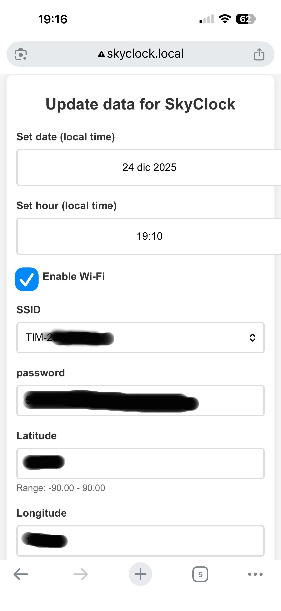
  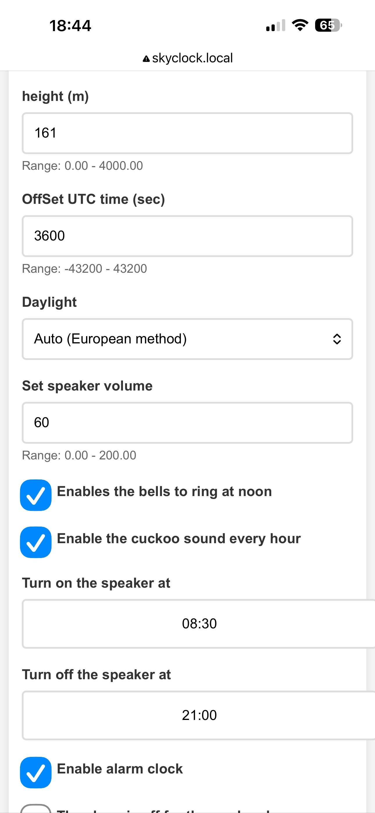
  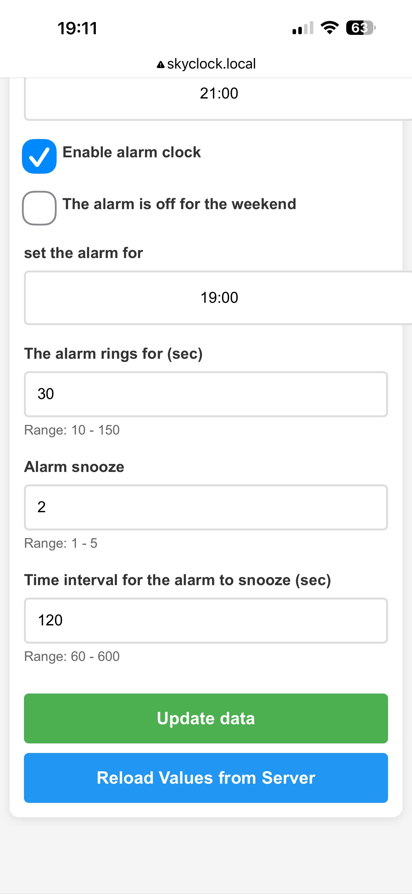
</p>

Let's see the meaning of the available parameters:

##### Set Date - Set Hour

Set the local date and time manually. If the [Enable Wi-Fi](#enable-wi-fi) flag is disabled, the internal clock of **SkyClock** will be configured with these manually entered values.

##### Enable Wi-Fi

Enables WiFi connection. This function is used to automatically connect **SkyClock** to NTP (Network Time Protocol) servers approximately every 24 hours, ensuring maximum time precision. If you do not have a WiFi network, disable this flag: **SkyClock** accuracy will still be maintained by the DS3231 RTC module.

##### SSID - password

These are the parameters required to connect to your home WiFi network. If the [Enable Wi-Fi](#enable-wi-fi) flag is disabled, these values will not be considered.

##### Latitude - Longitude - height

These parameters define the precise geographic location where **SkyClock** is located. All astronomical calculations (sunrise, sunset, position of Moon and planets) use these values. Pay attention to extreme latitude values: beyond ±83 degrees astronomical calculations may present significant errors.

##### Offset UTC time

This parameter defines the difference in seconds between local time and Coordinated Universal Time (UTC). All astronomical calculations are performed using UTC and then converted to local time through this parameter and the [Set DayLight](#set-daylight) flag value. For example, if you live in Rome, which is one hour ahead of UTC, the value to enter is 3600 (i.e. one hour expressed in seconds).

##### The alarm ring for

This parameter defines the maximum duration in seconds of the alarm sound before it turns off automatically.

##### Time interval for the alarm to snooze

This parameter specifies the time interval in seconds between one alarm repetition and the next. The total number of repetitions is defined by the [Alarm snooze](#alarm-snooze) parameter.

##### Other Parameters

These parameters have already been described in detail in the [Set Value](#set-value) section. Here is the complete list of correspondences:

- Daylight → [Set DayLight](#set-daylight)
- Set Speaker volume → [Set Volume](#set-volume)
- Enables the bells to ring at noon → [Enable bell sound](#enable-bell-sound)
- Enable the cuckoo sound every hour → [Cuckoo Sound](#cuckoo-sound)
- Turn on/off the speaker at → [Enable sound](#enable-sound)
- Enable alarm clock → [Alarm](#alarm)
- The alarm is off for the weekend → [Weekend alarm](#weekend-alarm)
- Set alarm for → [Set the alarm for](#set-the-alarm-for)
- Alarm snooze → [Alarm snooze](#alarm-snooze)

## Warnings

Building this project requires a minimum of experience with embedded systems. It's not exceptionally complicated, but you need to be familiar with using a soldering iron and the basic principles of electronics. :grinning:

The code may contain errors which I will correct as they are found. I invite you to report any problems or bugs through the repository issues.

Astronomical calculations are performed with good accuracy, although a margin of error of a couple of minutes on sunrise and sunset times should be considered normal and acceptable. Pay special attention for extreme latitudes beyond ±83 degrees: I have not been able to carry out extensive tests at these latitudes, so there is a remote possibility that some algorithms diverge or that calculation precision is not sufficient. For reference, the Svalbard islands are at about 78 degrees North... do you know anyone who lives further north? :wink:

The code development was done in my spare time, so it has not been developed continuously. This inevitably led to different approaches in writing the code. I apologize if the result appears fragmented, not sufficiently commented, or if you find Italian comments scattered here and there.

## Licensing

This program is free software: you can redistribute it and/or modify it under the terms of the [GNU General Public License v3.0](https://www.gnu.org/licenses/gpl-3.0.html) published by the Free Software Foundation, either version 3 of the License, or (at your option) any later version.

This code and all related parts (electrical schematic, PCB, 3D printing files, etc.) are distributed "as is" in the hope that they may be useful, but **WITHOUT ANY WARRANTY**, not even the implied warranty of MERCHANTABILITY or FITNESS FOR A PARTICULAR PURPOSE. See the GNU General Public License for more details.

All images used in the project were created via Python software I developed, using as a base freely licensed images downloaded from the internet.

Fonts use the [GFXglyph](https://github.com/adafruit/Adafruit-GFX-Library/blob/master/gfxfont.h) structure developed by [Adafruit](https://github.com/adafruit/Adafruit-GFX-Library) under the BSD license.

The [fonts](SkyClock32/Fonts) used in this software were derived from [fonts/gnu-freefont_freemono](https://github.com/opensourcedesign/fonts/tree/master/gnu-freefont_freemono) licensed under the [SIL Open Font License](https://openfontlicense.org/) and subsequently modified through the [freetype](https://github.com/ubawurinna/freetype-windows-binaries/tree/master) library.

All sounds were downloaded from [Freesound](https://freesound.org/) and then edited and adapted to the system using [Audacity](https://www.audacityteam.org/).

This software requires the [ESP8266Audio](https://github.com/earlephilhower/ESP8266Audio) library created by [earlephilhower (Earle F. Philhower, III)](https://github.com/earlephilhower).

## Disclaimer

This entire project is released under the GPL license and its use and construction are at your own risk. If you find bugs, please report them via the GitHub issue tracker or send me an email

Giuseppe Leotta

g.leotta63@hotmail.com
